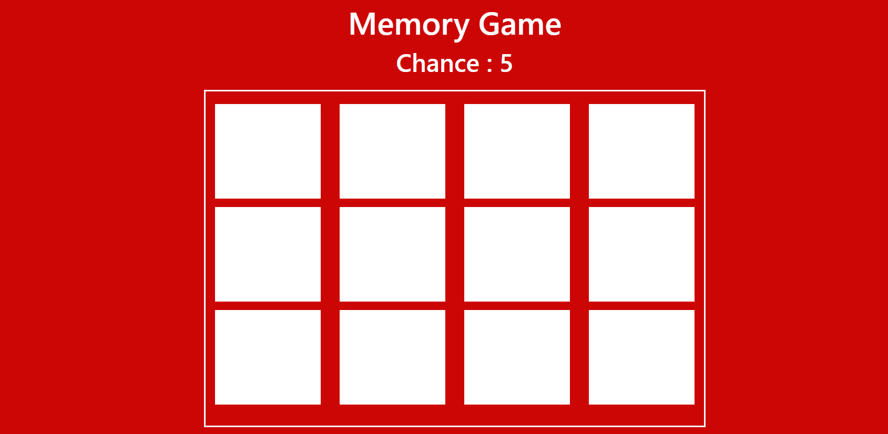

# Memory Game

A simple **Memory Game** built with **JavaScript**, **HTML**, and **CSS**. The game challenges players to match pairs of cards. Flip two cards at a time, and if they match, they remain face-up. If not, they will flip back. The game continues until all pairs are matched.

<div align="center">

[Live](https://shoaib73510.github.io/Memory-game-js/)


</div>


## Features
- **Card Matching**: Cards are shuffled and displayed face down. Players flip two cards at a time to match pairs.
- **Shuffle Mechanism**: Cards are shuffled at the start of the game for a random layout.
- **Timer**: Tracks the time taken to complete the game.
- **Move Counter**: Tracks the number of moves the player has made.
- **Winning Condition**: The game ends when all pairs are matched. A completion message appears with the time and number of moves.

## How to Play
1. Click on a card to flip it over and reveal its value.
2. Click on another card to flip it.
3. If the cards match, they stay face-up. If not, they will flip back after a short delay.
4. Keep matching pairs until all cards are revealed.
5. Once you match all pairs, the game will show your completion time and number of moves.

## Installation

1. Clone this repository:
   ```bash
   git clone https://github.com/shoaib73510/Memory-game-js.git
